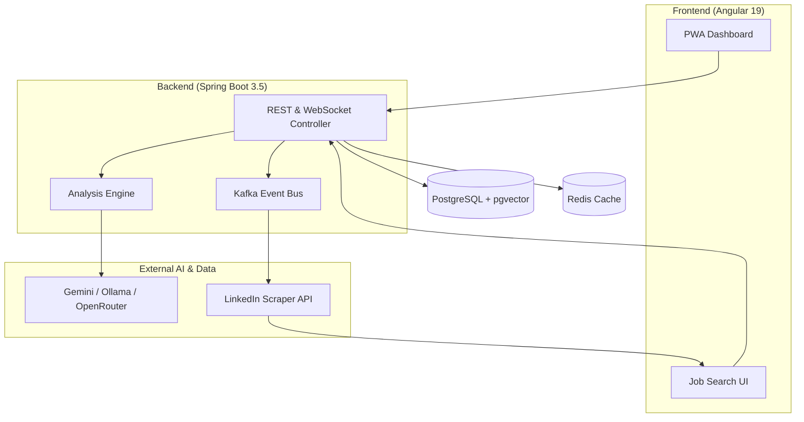

# CareerAlign Intelligence - Full-Stack AI Ecosystem

**CareerAlign Intelligence** is a robust, AI-driven platform built with Spring Boot 3.5 and Angular 19. It powers the end-to-end career lifecycle—from AI-powered job searching and resume analysis to manual application tracking and secure data backups.

---

## 🚀 Core Features

### 🧠 Multi-LLM Intelligence
- **Ollama Integration**: Powered by `minimax-m2.5:cloud` for efficient analysis.
- **Google Gemini Integration**: Native support for Gemini embedding models and text generation (`gemini-2.5-flash-lite`).
- **Hybrid ATS Scoring**: Semantic evaluation that prioritizes "Required" vs "Optional" skills with custom importance weighting.

### 🔍 LinkedIn Job Finder (NEW)
- **Real-time Scraping**: Integrated with a Playwright/Puppeteer-based scraper to find live LinkedIn jobs.
- **Intelligent Detail Fetching**: On-demand scraping of full job descriptions and required skills.
- **Search Criteria**: Filter by location, experience level (Entry/Mid/Senior), job type (Full-time/Contract), and remote status.

### 📋 Job Application Tracker
- **One-Click Tracking**: Directly add matched LinkedIn jobs to your personal tracker.
- **Workflow Management**: Manage applications through statuses: `INITIALIZED`, `APPLIED`, `PROCESSING`, `REJECTED`, `SELECTED`.
- **Resume Linking**: Associate specific resume analyses with individual job applications.

### 📅 Document & Data Management
- **Backup & Restore**: Export your entire job tracker history to CSV format for layman-friendly data portability.
- **Waitlist & PWA**: Fully functional Progressive Web App (PWA) with Android optimization and a managed early-access waitlist.
- **Resume Generation**: High-fidelity, ATS-readable PDF generation with real-time live previews.

---

## 🏗️ Architecture & Ecosystem

---

## 🛠️ Tech Stack

- **Backend**: Java 21, Spring Boot 3.5, Spring AI, Spring Kafka
- **Frontend**: Angular 19, PrimeNG 19, RxJS, PWA (Service Workers)
- **Data**: PostgreSQL 16 (pgvector), Redis 7
- **Infrastructure**: Docker Compose, Kafka (KRaft mode), Flyway
- **Tools**: Apache Tika (Extraction), OpenPDF (Generation)

---

## 🔧 API Highlights

| Category | Endpoint | Method | Description |
| :--- | :--- | :--- | :--- |
| **Analysis** | `/api/ai/analyze` | POST | Triggers asynchronous resume analysis via WebSocket. |
| **Scraper** | `/api/scraper/search` | POST | Initiates an async LinkedIn job search. |
| **Scraper** | `/api/scraper/details` | POST | Fetches full job details for a specific LinkedIn URL. |
| **Tracker** | `/api/applications` | POST/GET | Manage job application records. |
| **Backup** | `/api/applications/export` | GET | Download application history as CSV. |

---

## 👤 Author
**Nitin Manjhi**
*Full-Stack & AI Integration Engineer*
