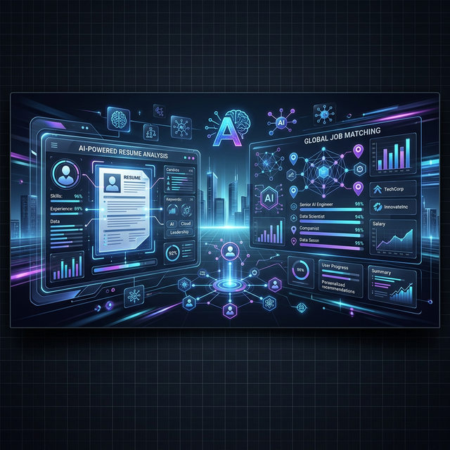
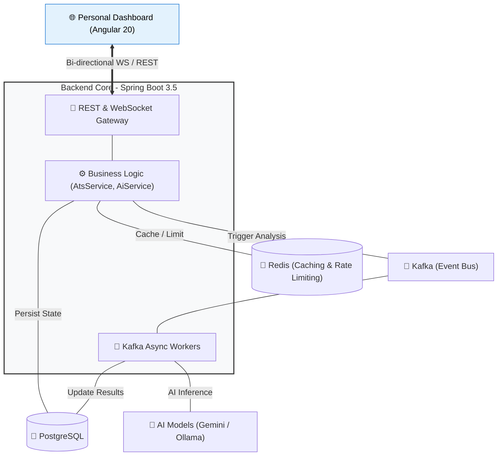

# CareerAlign Intelligence 🚀
### *The Ultimate AI-Powered Ecosystem for Career Growth & ATS Optimization*



---

## 🌟 Overview

**CareerAlign Intelligence** is a cutting-edge, enterprise-grade platform designed to revolutionize the way candidates navigate the modern job market. By leveraging multi-LLM orchestration (Google Gemini & Ollama) and advanced textual analysis, it provides deep resume analysis, real-time LinkedIn job scraping, and intelligent ATS scoring.

Built with **Spring Boot 3.5 (Java 21)** and **Angular 21**, this project showcases a robust modular architecture, event-driven processing via **Kafka**, and real-time state management through **WebSockets**.


---

## 🚀 Key Features

### 🧠 Multi-LLM Intelligence Engine
- **Hybrid Inference Orchestration**: Dynamically alternates between:
    - **Google Gemini 2.5 Flash**: Orchestrates high-speed, complex reasoning.
    - **Ollama**: Local model support (minimax-m2.5) for enhanced privacy and offline processing.
    - **OpenRouter & Nvidia Nemotron**: Specialized inference via lightweight, high-token models for lightning-fast analysis.
- **Semantic ATS Scoring**: Beyond simple keyword matching—analyzes professional context and experience relevance to score resumes against Job Descriptions (JD).
- **Skill Weighting**: Custom importance weighting for "Required" vs "Optional" skills, simulating real-world recruiter priorities.

### 🎙️ AI Interview Preparation
- **Dynamic Question Generation**: REST & WebSocket-based generation of technical (topic-wise) and behavioral (scenario-based) questions.
- **Contextual Intelligence**: Leverages specialized prompts to simulate realistic interview environments.
- **Persistence Layer**: Automated storage of preparation results for progress review and long-term learning.


### 🔍 Native LinkedIn Scraper
- **Performance-Driven Engine**: Migrated from external services to a native **Java Playwright** implementation for increased reliability and speed.
- **Deep Job Analysis**: Automatically extracts required skills, job location, and portal nuances directly from LinkedIn.
- **One-Click Tracking**: Seamlessly move scraped jobs into your tracking dashboard with pre-filled metadata.


### 📋 Enterprise Job Tracker
- **Enhanced Data Points**: New support for tracking **Job Title**, **Location**, and **Job Portal** for every application.
- **Stage Management**: Full lifecycle tracking from `INITIALIZED` to `SELECTED` with dynamic color-coded status tags.

- **Strategic Stats Dashboard**: A high-end analytics hub with:
    - **KPI Cards**: Real-time tracking of total applications, recent 7-day velocity, and AI-aligned reports.
    - **Status Distribution**: A grid-based visualization of conversion rates (Applied vs Interviewing).
- **Resume-Analysis Linking**: Every application is tied to a specific AI-driven analysis, allowing you to see *why* you matched with a job months later.
- **Data Portability**: Integrated backup and restore functionality via CSV export.

### 📱 Modern User Experience
- **Fluid UI**: Fully responsive Dashboard built with the latest Angular 20 features.
- **Live Resume Generation**: ATS-optimized PDF generation with real-time previewing.
- **Real-time Notifications**: WebSocket-driven progress updates for long-running AI tasks.

---

## 🏗️ High-Level Design (HLD)

### System Architecture
The platform follows a clean, event-driven architecture to ensure high performance and efficient task offloading.



### Core Data Flow: Resume Analysis
1. **Request**: User uploads a resume and pastes a JD.
2. **Preprocessing**: Apache Tika extracts text; Spring AI prepares the prompt.
3. **Queueing**: A job event is published to **Kafka** to handle the heavy AI lifting asynchronously.
4. **Processing**: A worker consumes the event, invokes the **LLM (Gemini/Ollama)**, and calculates the **ATS Score**.
5. **Real-time Feedback**: Progress and results are pushed back to the client via **STOMP/WebSockets**.
6. **Storage**: Final analysis and application history are stored in **PostgreSQL** for persistence and tracking.

---

## 🛠️ Tech Stack

| Category | Technologies |
| :--- | :--- |
| **Backend** | Java 21, Spring Boot 3.5.x, Spring AI, Java Playwright, Spring Security, Spring Kafka |
| **AI/ML** | Google Gemini 2.5 Flash, Ollama (Llama 3.2), Apache Tika |
| **Frontend** | Angular 21, PrimeNG 19, RxJS |

| **Database** | PostgreSQL 17, Redis 7 (Caching & Rate Limiting) |
| **Infrastructure**| Docker, Docker Compose, Flyway (Migrations) |
| **Dev Tools** | Maven, Git, Swagger / OpenAPI 3.0 |

---

## 📁 Project Structure

```text
├── career-align-intelligence (Backend)
│   ├── src/main/java/com/nit/
│   │   ├── config/      # Security, AI, WebSocket configs
│   │   ├── controller/  # REST Endpoints
│   │   ├── service/     # Core logic (AI, ATS, Kafka)
│   │   └── entity/      # JPA Models
│   └── src/main/resources/
│       └── db/migration # Flyway scripts
└── ResumeAi (Frontend)
    ├── src/app/
    │   ├── shared/      # Components, Models
    │   ├── core/        # Services, Guards
    │   └── features/    # Main modules (Dashboard, Analysis)
    └── angular.json
```

---

## 🔧 Getting Started

### Prerequisites
- JDK 21+
- Node.js 20+
- Docker & Docker Compose
- (Optional) Ollama running locally or Google Gemini API Key

### Installation

1. **Clone the repository**
   ```bash
   git clone https://github.com/nitin-manjhi/career-align-intelligence.git
   ```

2. **Configure Environment**
   Rename `.env.example` to `.env` and fill in your API keys and database credentials.

3. **Spin up Infrastructure**
   ```bash
   docker-compose up -d
   ```

4. **Run Backend**
   ```bash
   cd career-align-intelligence
   ./mvnw spring-boot:run
   ```

5. **Run Frontend**
   ```bash
   cd ResumeAi
   npm install
   npm start
   ```

---

## 👤 Author

**Nitin Manjhi**  
*Full-Stack & AI Integration Engineer*  
[LinkedIn](https://www.linkedin.com/in/nitinmanjhi) | [GitHub](https://github.com/nitin-manjhi) | [Portfolio](https://nitinmanjhi.com)

---
*Developed with ❤️ to empower job seekers in the AI era.*
