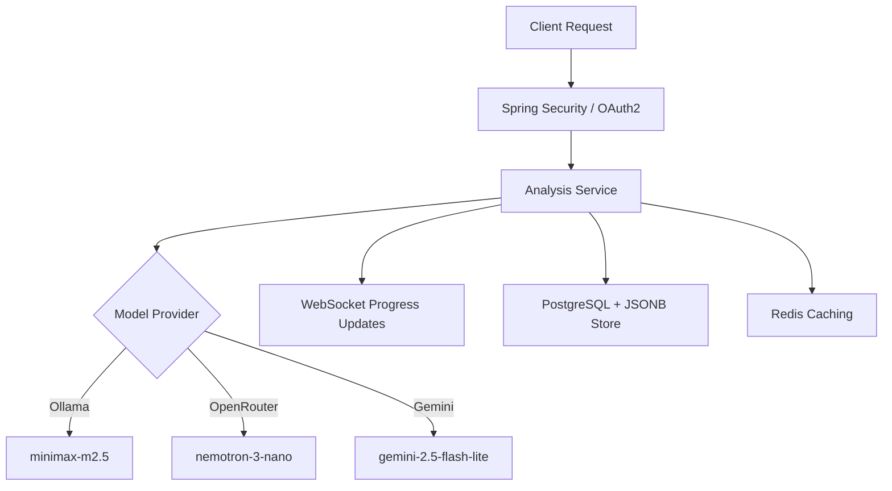

# CareerAlign Intelligence - Backend

**CareerAlign Intelligence** is a robust, AI-driven microservice built with Spring Boot 3.5. It powers the resume analysis and generation workflows by orchestrating multiple LLM providers, managing complex asynchronous tasks via WebSockets, and providing a highly accurate ATS evaluation engine.

---

## 🚀 Core Features

### 🧠 Multi-LLM Intelligence
- **Ollama Integration**: Powered by `minimax-m2.5:cloud` for efficient analysis (Standard Intelligence).
- **OpenAI & OpenRouter Integration**: Powered by `nvidia/nemotron-3-nano-30b-a3b` (Advanced AI Pro).
- **Google Gemini Integration**: Powered by `gemini-2.5-flash-lite` for high-fidelity analysis (Elite AI Deep).

### 📊 Hybrid ATS Scoring Engine
- **Keyword Matching**: Precise analysis of technical and soft skills.
- **Semantic Evaluation**: Goes beyond keyword counting to understand context and intent.
- **Experience Scoring**: Evaluates the depth and relevance of professional history.
- **Skill Importance Weighting**: Prioritizes skills based on their significance in the JD (Required vs Optional).

### ⚡ Real-Time Processing
- **WebSocket Notifications**: Asynchronous processing with live progress updates (Analysis -> Cover Letter -> Email).
- **Parallel Task Execution**: Faster document generation using Java CompletableFuture.

### 📂 Intelligence & Location APIs
- **Smart Skill Categorization**: AI-powered grouping of raw skills into professional categories (Languages, Tools, etc.).
- **Location & Education Services**: Integrated data providers for accurate State/City/College selection.

---

## 🏗️ Architecture & Logic

---

## 🛠️ Tech Stack & Dependencies

- **Framework**: Spring Boot 3.5 (Java 21)
- **AI Orchestration**: Spring AI (OpenAI, Ollama, Google GenAI)
- **Persistence**: PostgreSQL 16 + JSONB (Flexible storage for AI responses)
- **Caching**: Redis (For skill categorization and frequent lookups)
- **Real-time**: Spring WebSocket (STOMP)
- **Document Processing**:
  - **Apache Tika**: Multi-format text extraction (PDF, DOCX)
  - **OpenPDF**: Text-based, ATS-readable PDF generation
- **Security**: Spring Security + JWT + OAuth2
- **Infrastructure**: Flyway (Database Migrations), Maven, Docker

---

## 🔧 API Highlights

| Endpoint | Method | Description |
| :--- | :--- | :--- |
| `/api/ai/analyze` | POST | Triggers multi-step asynchronous resume analysis. |
| `/api/ai/categorize` | POST | Uses AI to group skills into professional categories. |
| `/api/locations/states` | GET | Fetch list of Indian States. |
| `/api/education/colleges` | GET | Fetch accredited colleges by state. |

---

## 👤 Author
**Nitin Manjhi**
*Full-Stack & AI Integration Engineer*
