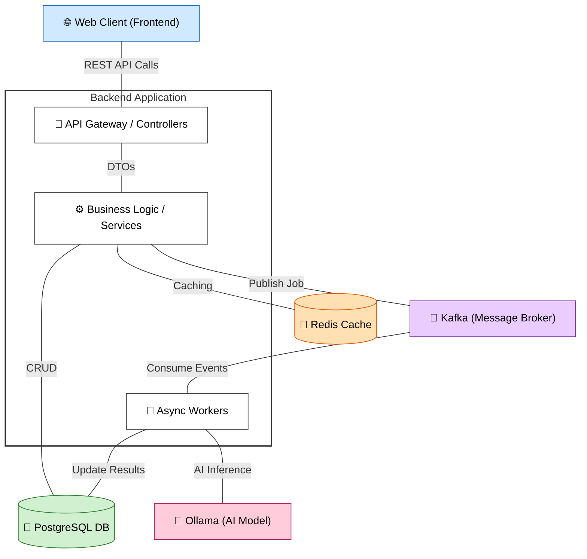
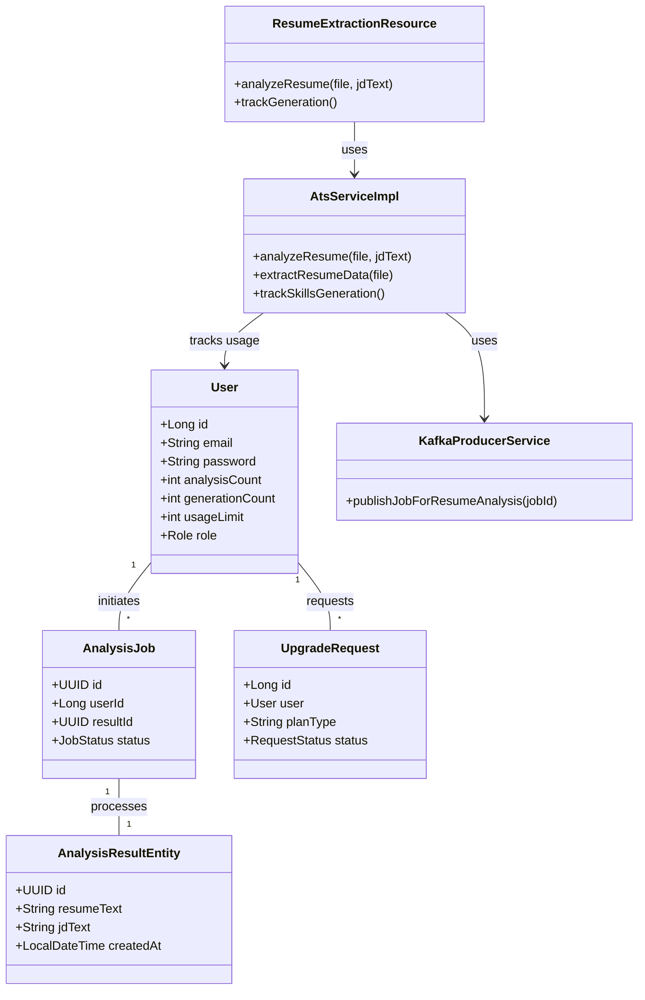
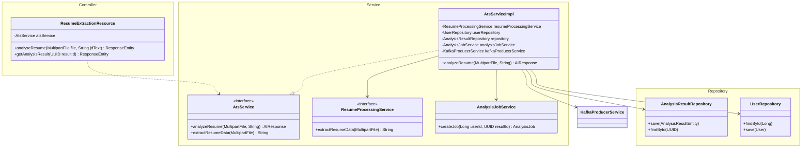
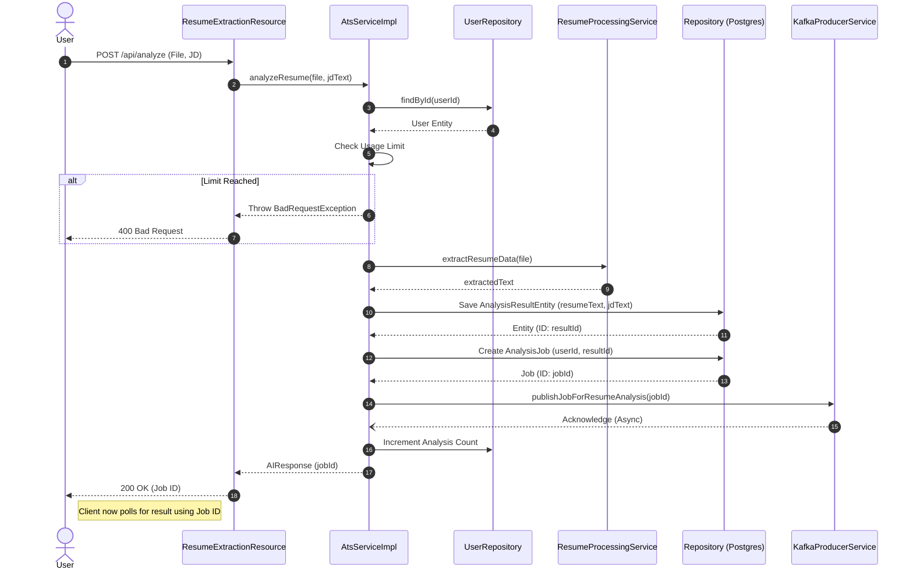

# Backend Architecture Documentation

This document contains the UML diagrams for the Career Align Intelligence backend project.

## 1. High-Level Design (HLD) - Component Diagram

## 2. High-Level Class Diagram

## 3. Low-Level Design (LLD) - Detailed Class Diagram (Analysis Module)

## 4. Sequence Diagram (Resume Analysis Flow)

